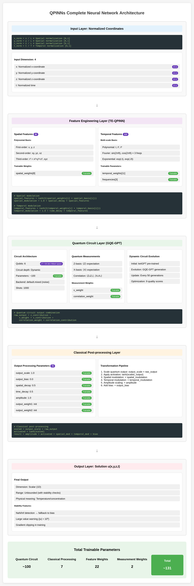
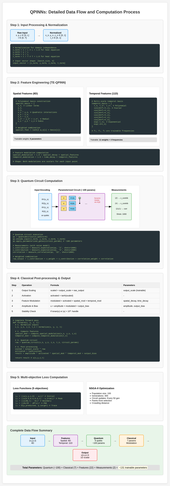

QPINNs Implementation
=====================

This chapter details the implementation of Quantum Physics-Informed Neural Networks (QPINNs) with advanced features including ketGPT, GQE-GPT circuit generation, and trainable embeddings.

GQE-GPT Architecture Overview
-----------------------------

The Generative Quantum Eigensolver with GPT (GQE-GPT) system consists of three main components:

1. **GPT-based Circuit Generator**: Generates quantum circuit architectures
2. **Quantum Circuit Executor**: Evaluates circuits on quantum simulators/hardware
3. **Circuit Optimizer**: Selects optimal circuits via Bayesian multi-objective search

.. code-block:: python

   class GQEQuantumPINN:
       def __init__(self, 
                    n_qubits=6,
                    backend='default.mixed',
                    shots=1000,
                    noise_model='realistic',
                    use_gpt_circuit_generation=True):

KetGPT Integration
------------------

The system leverages the ketGPT dataset for pre-training the circuit generation model:

Dataset Loading
^^^^^^^^^^^^^^^

.. code-block:: python

   def _initialize_ketgpt_dataset(self):
       """Load and preprocess ketGPT dataset
       Reference: Apak et al. "KetGPT – Dataset Augmentation of 
                  Quantum Circuits using Transformers" arXiv:2402.13352 (2024)
       """
       [ketgpt_dataset] = qml.data.load("ketgpt")
       
       # Extract circuit data
       for circuit in ketgpt_dataset.circuits:
           gate_sequence = self._pennylane_to_gate_sequence(circuit)
           if gate_sequence and len(gate_sequence) <= self.max_circuit_depth:
               self.pretrain_data.append({
                   'gate_sequence': gate_sequence,
                   'energy': -1.0 - 0.01 * i,
                   'score': 0.8 + 0.001 * i
               })

GPT Model Architecture
^^^^^^^^^^^^^^^^^^^^^^

The transformer-based GPT model for circuit generation:

.. code-block:: python

   class QuantumCircuitGPT(nn.Module):
       def __init__(self, vocab_size, n_embd=256, n_head=8, 
                    n_layer=6, block_size=128, dropout=0.1):
           super().__init__()
           self.token_embedding = nn.Embedding(vocab_size, n_embd)
           self.position_embedding = nn.Embedding(block_size, n_embd)
           self.blocks = nn.Sequential(*[Block(n_embd, n_head, dropout) 
                                       for _ in range(n_layer)])
           self.ln_f = nn.LayerNorm(n_embd)
           self.head = nn.Linear(n_embd, vocab_size)

Circuit Tokenization
^^^^^^^^^^^^^^^^^^^^

Quantum gates are converted to tokens for GPT processing:

.. code-block:: python

   # Gate vocabulary
   gate_tokens = ['<PAD>', '<START>', '<END>', '<SEP>',
                  'H', 'X', 'Y', 'Z', 'S', 'T', 'CNOT', 'CZ', 'SWAP',
                  'RX', 'RY', 'RZ', 'Q0', 'Q1', 'Q2', 'Q3', 'Q4', 'Q5',
                  'PARAM_0', 'PARAM_1', ..., 'PARAM_15']

Quantum Circuit Template
------------------------

The quantum circuit architecture is defined by templates:

Gate Sequence Structure
^^^^^^^^^^^^^^^^^^^^^^^

.. code-block:: python

   class QuantumCircuitTemplate:
       def __init__(self):
           self.gate_sequence = [
               {'gate': 'RY', 'qubits': [0], 'trainable': True, 'param_idx': 0},
               {'gate': 'RY', 'qubits': [1], 'trainable': True, 'param_idx': 1},
               {'gate': 'CNOT', 'qubits': [0, 1], 'trainable': False},
               ...
           ]

Hardware-Efficient Ansatz
^^^^^^^^^^^^^^^^^^^^^^^^^

The implementation uses hardware-efficient ansätze optimized for NISQ devices:

.. math::

   U(\theta) = \prod_{l=1}^{L} \left[ \prod_{i=1}^{n} R_y^{(i)}(\theta_{l,i}) \prod_{(i,j) \in E} \text{CNOT}_{i,j} \right]

where :math:`E` represents the hardware connectivity graph.

Trainable Embedding (TE-QPINN)
------------------------------

The TE-QPINN approach introduces learnable feature embeddings:

Spatial Feature Embedding
^^^^^^^^^^^^^^^^^^^^^^^^^

.. code-block:: python

   def _compute_spatial_features(self, x_norm, y_norm, z_norm):
       """Compute polynomial spatial features
       Reference: TE-QPINN (2025) - polynomial basis for spatial embedding
       """
       features = [
           x_norm,                    # Linear terms
           y_norm,
           z_norm,
           x_norm * y_norm,          # Quadratic interactions
           y_norm * z_norm,
           x_norm * z_norm,
           x_norm**2 + y_norm**2 + z_norm**2,  # Radial component
           x_norm * y_norm * z_norm  # Cubic interaction
       ]
       
       # Weighted combination with learnable weights
       weighted_sum = sum(w * f for w, f in 
                         zip(self.spatial_feature_weights, features))
       return np.tanh(weighted_sum)

The spatial features use 8 polynomial basis functions:

.. math::

   \Phi_{\text{spatial}} = \tanh\left(\sum_{i=1}^{8} w_i^{(s)} \phi_i^{(s)}(x,y,z)\right)

where :math:`\phi_i^{(s)}` are: :math:`\{x, y, z, xy, yz, xz, x^2+y^2+z^2, xyz\}`

Temporal Feature Embedding
^^^^^^^^^^^^^^^^^^^^^^^^^^

Multi-scale temporal features with learnable frequencies:

.. code-block:: python

   def _compute_temporal_features(self, t_norm):
       """Compute mixed-basis temporal features"""
       features = []
       
       # Polynomial basis
       features.extend([t_norm, t_norm**2, t_norm**3])
       
       # Fourier basis with learnable frequencies
       frequencies = np.abs(self.temporal_frequencies.numpy())
       for freq in frequencies:
           features.append(np.sin(2 * np.pi * freq * t_norm))
           features.append(np.cos(2 * np.pi * freq * t_norm))
       
       # Exponential basis
       features.append(np.exp(-t_norm))
       features.append(1.0 - np.exp(-t_norm))
       
       # Learnable weighted combination
       weighted_sum = sum(w * f for w, f in 
                         zip(self.temporal_feature_weights, features))
       return np.tanh(weighted_sum)

The temporal features use mixed basis with learnable frequencies:

.. math::

   \Phi_{\text{temporal}} = \tanh\left(\sum_{j=1}^{11} w_j^{(t)} \phi_j^{(t)}(t)\right)

where :math:`\phi_j^{(t)}` include:
- Polynomial: :math:`\{t, t^2, t^3\}`
- Fourier: :math:`\{\sin(2\pi f_k t), \cos(2\pi f_k t)\}` with learnable :math:`f_k`
- Exponential: :math:`\{e^{-t}, 1-e^{-t}\}`

Parameter Initialization
^^^^^^^^^^^^^^^^^^^^^^^^

.. code-block:: python

   def _initialize_feature_parameters(self):
       """Initialize learnable embedding parameters
       References:
       - Li et al. (2021) ICLR - Fourier frequency initialization
       - TE-QPINN (2025) - Feature design
       """
       # Spatial features: 8 weights
       self.spatial_feature_weights = qml.numpy.array(
           np.random.normal(0, 0.1, size=8),
           requires_grad=True
       )
       
       # Temporal frequencies: logarithmic spacing
       initial_frequencies = np.array([2**i for i in range(3)])
       self.temporal_frequencies = qml.numpy.array(
           initial_frequencies,
           requires_grad=True
       )
       
       # Temporal feature weights: 11 total
       self.temporal_feature_weights = qml.numpy.array(
           np.random.normal(0, 0.1, size=11),
           requires_grad=True
       )

Circuit Optimization with Bayesian Multi-Objective Search
-----------------------------------------------------------

Multi-objective optimization for quantum circuits:

Objective Functions
^^^^^^^^^^^^^^^^^^^

The QPINN uses five objectives for circuit optimization:

.. code-block:: python

   def _evaluate_template(self, template):
       objectives = []
       
       # 1. Hardware efficiency
       hardware_score = self._compute_hardware_efficiency_scientific(template)
       objectives.append(1.0 - hardware_score)  # Minimize
       
       # 2. Noise resilience
       noise_score = self._compute_noise_resilience_scientific(template)
       objectives.append(1.0 - noise_score)  # Minimize
       
       # 3. Circuit depth
       depth = self._estimate_circuit_depth_from_template(template)
       objectives.append(depth / 100.0)  # Normalized
       
       # 4. Expressivity
       expressivity = self._compute_expressivity_scientific(template)
       objectives.append(1.0 - expressivity)  # Minimize
       
       # 5. Energy estimation quality
       energy_quality = self._compute_energy_estimation_quality_scientific(
           template, training_data)
       objectives.append(1.0 - energy_quality)  # Minimize
       
       return torch.tensor(objectives)

Hardware Efficiency Calculation
^^^^^^^^^^^^^^^^^^^^^^^^^^^^^^^

Based on real quantum device characteristics:

.. code-block:: python

   def _compute_hardware_efficiency_scientific(self, template):
       """Reference: Kandala et al. Nature 549, 242-246 (2017)"""
       
       # Gate times (ns)
       gate_times = {
           'RX': 35.56, 'RY': 35.56, 'RZ': 0.0,  # Virtual Z
           'CNOT': 300.8, 'CZ': 300.8, 'SWAP': 902.4
       }
       
       # Gate error rates
       gate_errors = {
           'RX': 2.16e-4, 'RY': 2.16e-4, 'RZ': 0.0,
           'CNOT': 9.11e-3, 'CZ': 9.11e-3, 'SWAP': 2.73e-2
       }
       
       # Calculate total time and error probability
       total_time = sum(gate_times.get(gate['gate'], 50.0) 
                       for gate in template.gate_sequence)
       
       # Score based on time efficiency and error rate
       time_efficiency = np.exp(-total_time / 5000.0)
       error_efficiency = (1 - total_error_prob) ** 2
       
       return 0.3 * time_efficiency + 0.3 * error_efficiency + ...

Noise Modeling
--------------

Realistic noise models for NISQ devices:

Noise Channels
^^^^^^^^^^^^^^

.. code-block:: python

   def _apply_hardware_noise(self, wire):
       """Apply realistic noise channels
       Reference: Trahan et al. Entropy 26(8):649 (2024)
       """
       noise_rates = {
           'light': {'depolarizing': 0.001, 'amplitude_damping': 0.0005},
           'realistic': {'depolarizing': 0.005, 'amplitude_damping': 0.002},
           'heavy': {'depolarizing': 0.01, 'amplitude_damping': 0.005}
       }
       
       rates = noise_rates.get(self.noise_model, noise_rates['realistic'])
       
       if rates['depolarizing'] > 0:
           qml.DepolarizingChannel(rates['depolarizing'], wires=wire)
       
       if rates['amplitude_damping'] > 0:
           qml.AmplitudeDamping(rates['amplitude_damping'], wires=wire)

Measurement Processing
----------------------

Quantum measurements are processed to extract the solution:

Z-basis Measurements
^^^^^^^^^^^^^^^^^^^^

.. code-block:: python

   def _compute_z_contribution(self, measurements_array, n_measurements, t):
       """Z-basis measurement value calculation"""
       if n_measurements >= 4:
           z_measurements = measurements_array[:4]
           
           # Time-modulated weights
           base_weights = np.array([0.4, 0.3, 0.2, 0.1])
           time_modulation = 1.0 + 0.5 * np.sin(t * np.pi / T)
           z_weights = base_weights * time_modulation
           
           return np.sum(z_measurements * z_weights)

Final Output Computation
^^^^^^^^^^^^^^^^^^^^^^^^

.. code-block:: python

   def _compute_final_output(self, z_contribution, x_contribution, 
                            correlation_contribution, x, y, z, t):
       """Scientifically grounded output transformation
       Reference: Trahan et al. (2024) - tanh activation recommended
       """
       # Quantum measurement combination
       raw_output = (z_contribution + 
                    self.x_weight * x_contribution + 
                    self.correlation_weight * correlation_contribution)
       
       # Output scaling and activation
       scaled_output = self.output_scale * raw_output
       activated_output = np.tanh(scaled_output)
       
       # Feature-based modulation
       spatial_modulation = 1.0 + self.spatial_decay * spatial_features
       temporal_modulation = 1.0 + self.time_decay * temporal_features
       
       result = (self.amplitude * activated_output * 
                spatial_modulation * temporal_modulation + 
                self.output_bias)

Bayesian Multi-Objective Optimization
-------------------------------------

The system uses Bayesian optimization with 9 objectives for quantum circuit search:

Nine Objective Functions
^^^^^^^^^^^^^^^^^^^^^^^^

.. code-block:: python

   def evaluate_circuit_multi_objective(self, template, training_data=None):
       """Evaluate 9 objectives for quantum circuit optimization"""
       objectives = []
       
       # 1. Hardware efficiency (minimize)
       hardware_score = self._compute_hardware_efficiency_scientific(template)
       objectives.append(1.0 - hardware_score)
       
       # 2. Noise resilience (minimize)
       noise_score = self._compute_noise_resilience_scientific(template)
       objectives.append(1.0 - noise_score)
       
       # 3. Expressivity (minimize inverse)
       expressivity = self._compute_expressivity_scientific(template)
       objectives.append(1.0 - expressivity)
       
       # 4. Mitigation compatibility (minimize)
       mitigation_score = self._compute_mitigation_compatibility(template)
       objectives.append(1.0 - mitigation_score)
       
       # 5. Trainability (minimize)
       trainability = self._compute_trainability_scientific(template)
       objectives.append(1.0 - trainability)
       
       # 6. Entanglement capability (minimize)
       entanglement = self._compute_entanglement_capability(template)
       objectives.append(1.0 - entanglement)
       
       # 7. Circuit depth efficiency (minimize)
       depth = self._estimate_circuit_depth_from_template(template)
       objectives.append(depth / 100.0)
       
       # 8. Parameter efficiency (minimize)
       param_efficiency = self._compute_parameter_efficiency(template)
       objectives.append(1.0 - param_efficiency)
       
       # 9. Energy estimation quality (minimize)
       energy_quality = self._compute_energy_estimation_quality_scientific(
           template, training_data)
       objectives.append(1.0 - energy_quality)
       
       return torch.tensor(objectives)

Unsupervised Energy Estimation
^^^^^^^^^^^^^^^^^^^^^^^^^^^^^^^

The energy estimation quality (9th objective) evaluates the quantum circuit's ability to estimate energy without supervision:

.. code-block:: python

   def _compute_energy_estimation_quality_scientific(self, template, training_data):
       """Scientific calculation of energy estimation quality
       
       References:
       - Cerezo et al. (2021) Nature Communications 12, 1791
       - Li et al. (2020) Physical Review Research 2, 013020
       """
       # 1. Energy landscape smoothness
       landscape_smoothness = self._evaluate_energy_landscape_smoothness(template)
       
       # 2. Convergence properties
       convergence_score = self._evaluate_energy_convergence(template, training_data)
       
       # 3. Noise stability
       noise_stability = self._evaluate_energy_noise_stability(template)
       
       # 4. Information theoretical quality
       information_quality = self._evaluate_energy_information_quality(template)
       
       # 5. Quantum Fisher information
       fisher_score = self._compute_quantum_fisher_information_score(template)
       
       # Weighted combination
       energy_quality = (
           0.25 * landscape_smoothness +
           0.20 * convergence_score +
           0.20 * noise_stability +
           0.20 * information_quality +
           0.15 * fisher_score
       )
       
       return energy_quality

Energy Landscape Analysis
~~~~~~~~~~~~~~~~~~~~~~~~~

.. code-block:: python

   def _evaluate_energy_landscape_smoothness(self, template):
       """Evaluate smoothness of energy landscape for optimization"""
       # Parameter perturbation analysis
       n_samples = 10
       perturbation_scale = 0.1
       
       base_params = np.random.uniform(-np.pi, np.pi, 
                                     len(template.parameter_map))
       energies = []
       
       for _ in range(n_samples):
           perturbed_params = base_params + np.random.normal(
               0, perturbation_scale, len(base_params))
           
           # Estimate energy with perturbed parameters
           energy = self._estimate_single_energy(template, perturbed_params)
           energies.append(energy)
       
       # Smoothness metric based on variance
       energy_variance = np.var(energies)
       smoothness = np.exp(-energy_variance / 0.1)
       
       return smoothness

GQE-GPT Circuit Generation Process
----------------------------------

The complete circuit generation process with GPT:

1. **Context Creation**
   
   .. code-block:: python
   
      context = self._create_generation_context(optimization_data)
      # Contains: current performance, target objectives, preference weights

2. **Candidate Generation**
   
   .. code-block:: python
   
      candidates = []
      for _ in range(n_candidates):
          # Generate circuit with contextual bias
          circuit_tokens = self._generate_circuit_with_context(
              gpt_model, context, temperature=0.8)
          
          # Convert to template
          template = self._tokens_to_template(circuit_tokens)
          candidates.append(template)

3. **Multi-objective Evaluation**
   
   .. code-block:: python
   
      # Batch evaluation of 9 objectives
      evaluated_candidates = self._batch_evaluate_candidates(
          candidates, mo_optimizer, context)

4. **Pareto Selection**
   
   .. code-block:: python
   
      # Find Pareto-optimal circuits
      pareto_indices = self._find_pareto_optimal(evaluated_candidates)
      pareto_candidates = [evaluated_candidates[i] for i in pareto_indices]

5. **Preference-based Selection**
   
   .. code-block:: python
   
      # Select best circuit based on preferences
      best_circuit = self._select_best_from_pareto(
          pareto_candidates, context)

Bayesian Acquisition Function
^^^^^^^^^^^^^^^^^^^^^^^^^^^^^

The Bayesian optimizer uses expected improvement for multi-objective optimization:

.. code-block:: python

   def _bayesian_acquisition(self, candidates, gp_models):
       """Multi-objective expected improvement"""
       mean_predictions = []
       std_predictions = []
       
       for model in gp_models:
           mean, std = model.predict(candidates, return_std=True)
           mean_predictions.append(mean)
           std_predictions.append(std)
       
       # Compute Pareto improvement probability
       improvement = self._compute_pareto_improvement(
           mean_predictions, std_predictions)
       
       return improvement

Training with SPSA and ReLoBRaLo Adaptive Loss Weighting
----------------------------------------------------------

The QPINN is trained using the PennyLane ``SPSAOptimizer`` (Simultaneous Perturbation
Stochastic Approximation), combined with ReLoBRaLo adaptive loss weighting
(Bischof & Kraus, 2025).

SPSA Optimizer
^^^^^^^^^^^^^^

SPSA is well-suited for quantum circuit parameter optimization because it estimates
the gradient using only two function evaluations per step, regardless of the number
of parameters:

.. math::

   \hat{g}_k(\theta) = \frac{f(\theta + c_k \Delta_k) - f(\theta - c_k \Delta_k)}{2 c_k} \Delta_k^{-1}

where :math:`\Delta_k` is a random perturbation vector with Rademacher-distributed
components, and :math:`c_k` is a decreasing perturbation magnitude.

.. code-block:: python

   import pennylane as qml

   opt = qml.SPSAOptimizer(maxiter=200)

   for step in range(200):
       params, cost = opt.step_and_cost(cost_fn, params)

ReLoBRaLo Adaptive Loss Weighting
^^^^^^^^^^^^^^^^^^^^^^^^^^^^^^^^^^

As with the PINN, the QPINN uses ReLoBRaLo to dynamically balance its five loss
components during training.  See :doc:`pinns_implementation` for the full algorithm
description.  The five loss components are:

1. **Initial condition loss** -- agreement at :math:`t=0`
2. **Peak value loss** -- agreement at the domain center :math:`(L/2, L/2, L/2)`
3. **Boundary condition loss** -- Dirichlet BC satisfaction
4. **PDE residual loss** -- heat equation residual (finite differences)
5. **Trace distance** -- quantum state fidelity metric

.. code-block:: python

   def compute_qpinn_losses(qpinn, test_points):
       """Compute QPINN loss components."""
       predictions = []
       for point in test_points:
           u_pred = qpinn.forward([point.x, point.y, point.z, point.t])
           predictions.append(u_pred)

       # 1. Initial condition loss
       initial_loss = np.mean([
           abs(pred - point.u_true)**2
           for pred, point in zip(predictions, test_points)
           if point.t == 0.0
       ])

       # 2. Peak value loss
       peak_loss = np.mean([
           abs(pred - analytical_solution(L/2, L/2, L/2, point.t))**2
           for pred, point in zip(predictions, test_points)
           if point.x == L/2 and point.y == L/2 and point.z == L/2
       ])

       # 3. Boundary condition loss
       boundary_loss = np.mean([
           abs(pred)**2
           for pred, point in zip(predictions, test_points)
           if (point.x == 0 or point.x == L or
               point.y == 0 or point.y == L or
               point.z == 0 or point.z == L)
       ])

       # 4. PDE residual loss (finite differences)
       pde_loss = qpinn._compute_pde_residual_fd(predictions, test_points)

       # 5. Trace distance (quantum-specific)
       trace_loss = qpinn._compute_trace_distance()

       return [initial_loss, peak_loss, boundary_loss, pde_loss, trace_loss]

The combined training loss at each step uses ReLoBRaLo weights:

.. math::

   \mathcal{L}_{\text{total}}^{(t)} = \sum_{i=1}^{5} \alpha_i^{(t)} \, \mathcal{L}_i^{(t)}

Trace Distance Calculation
^^^^^^^^^^^^^^^^^^^^^^^^^^

The trace distance measures quantum state similarity:

.. code-block:: python

   def _compute_trace_distance(self):
       """Compute trace distance for quantum state comparison"""
       # Get quantum state from circuit
       state = self.dev.state
       
       # Target state (approximation of thermal state)
       target_state = self._construct_target_state()
       
       # Trace distance: Tr|ρ - σ|
       diff = state - target_state
       trace_distance = np.trace(np.abs(diff))
       
       return trace_distance / 2.0  # Normalized

Circuit Training Process
------------------------

The complete QPINN training flow:

1. **Initial Circuit Generation**

   - Hardware-efficient ansatz or GPT-generated circuit
   - 9-objective evaluation for circuit quality
   - Select best initial circuit

2. **SPSA Training with ReLoBRaLo**

   - Optimize circuit parameters using PennyLane SPSAOptimizer
   - Adaptive loss weighting via ReLoBRaLo across 5 PDE-specific loss terms
   - Iterations: 200

3. **Dynamic Circuit Updates**

   - Periodically evaluate if circuit update is needed
   - Generate new candidates with GQE-GPT
   - Replace circuit if improvement found

4. **Final Evaluation**

   - Evaluate on full grid with best parameters

References
----------

* Apak et al. (2024) "KetGPT -- Dataset Augmentation of Quantum Circuits"
* Trahan et al. (2024) "Quantum Physics-Informed Neural Networks"
* TE-QPINN (2025) "Trainable embedding quantum physics informed neural networks"
* Panichi et al. (2025) "Quantum physics informed neural networks for multi-variable PDEs"
* Nakaji & Yamamoto (2021) "Quantum circuit design by Generative Quantum Eigensolver"
* Spall (1998) "An Overview of the Simultaneous Perturbation Method for Efficient Optimization" (SPSA)
* Bischof & Kraus (2025) "ReLoBRaLo: Relative Loss Balancing with Random Lookback for Multi-Task Learning"